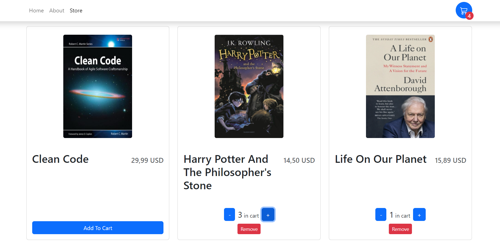

# Book Store Cart with React, TypeScript, and Bootstrap

A fully functional shopping cart built using React, TypeScript, and Bootstrap.

## Table of Contents

- [Demo](#demo)
- [Features](#features)
- [Technologies Used](#technologies-used)
- [Installation](#installation)
- [Usage](#usage)
- [Contributing](#contributing)

## Demo




## Features

- Add products to the cart
- Remove products from the cart
- Update the quantity of products in the cart
- Calculate and display the total price of items in the cart
- Responsive design for various screen sizes

## Technologies Used

- [React](https://reactjs.org/)
- [TypeScript](https://www.typescriptlang.org/)
- [Bootstrap](https://getbootstrap.com/)

## Installation

1. Clone the repository:

   ```bash
   git clone git@github.com:bettitaksas/book-store.git

2. Install dependencies

   ```bash
   npm install

## Installation

1. Start the development server.

   ```bash
   npm run dev

2. Open your web browser and visit http://localhost:5174 to view the application.

## Contributing
Contributions are welcome! If you'd like to contribute to this project, please follow these guidelines:

- Fork the repository.
- Create a new branch for your feature or bug fix.
- Make your changes and ensure the code is properly tested.
- Submit a pull request with a detailed description of your changes.